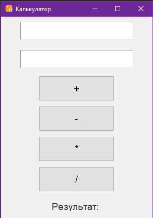

# 🧮 Калькулятор на Python

Это простой калькулятор с графическим интерфейсом, написанный на Python с использованием библиотек `tkinter` и `logging`.

## 🔧 Функционал
- Сложение, вычитание, умножение и деление.
- Проверка на деление на ноль.
- Логирование действий в файл `калькулятор_лог.txt`.
- Графический интерфейс с цветами и стилем.

## ▶️ Как запустить
1. Убедитесь, что установлен Python 3.x.
2. Скачайте проект и откройте папку в терминале.
3. Запустите программу:
   ```bash
   python калькулятор.py

## 🖥 Пример интерфейса

